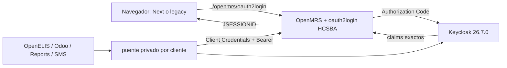

# Keycloak SSO para Bahmni HCSBA

Para ejecutar tambien OpenMRS/MySQL como una copia aislada en localhost, consulte
[`OPENMRS_LOCAL.md`](OPENMRS_LOCAL.md). Ese perfil permite completar el flujo OIDC sin instalar
el OMOD en `.205`.

Esta implementación mantiene una sola sesión clínica OpenMRS (`JSESSIONID`) para Next.js y legacy. Keycloak autentica y emite identidad/roles; OpenMRS sigue siendo la autoridad de privilegios, Provider y `Login Locations`. No se guardan access/refresh tokens en el navegador y no se agrega un BFF.

El logout global termina primero OpenMRS y luego la sesión OIDC. Keycloak retorna a
`/bahmni/login?loggedOut=1`; esa marca evita que Next.js inicie inmediatamente otro Authorization
Code Flow antes de mostrar la confirmación de cierre. El usuario debe pulsar explícitamente
`Volver a iniciar sesión` para comenzar una sesión nueva.

## Arquitectura



El overlay `bahmni-standard/docker-compose.keycloak.yml` no altera el arranque base y sólo se activa con el perfil `sso`. Las imágenes de Keycloak, PostgreSQL y los puentes están fijadas por versión y digest. El puerto `18080` sólo se publica en loopback para automatizaciones administrativas; no debe usarse para la consola web porque Keycloak genera sus recursos con el hostname público. La interfaz de gestión `9000` no se publica.

La consola administrativa usa la ruta canónica `https://sso-dev.hcsba.local/admin/master/console/`. Se autentica contra el realm `master` y luego se selecciona `hcsba`. Apache restringe tanto `/admin/` como `/realms/master/` a `KEYCLOAK_ADMIN_CIDR` y al origen confiable del proxy (`KEYCLOAK_ADMIN_PROXY_CIDR`). En Docker Desktop local este último corresponde a la red bridge; en producción debe reemplazarse por la subred exacta del reverse proxy o balanceador, además de la restricción perimetral de red.

Cuando el clon aislado `openmrs-local` está activo, `sso.ps1 integrate` delega la reconciliación a `local-openmrs.ps1 up`. Esto conserva el define Apache `LOCAL_OPENMRS` y evita que `/openmrs/oauth2login` sea enviado accidentalmente al backend compartido `.205`.

## Tema visual HCSBA

El realm `hcsba` usa el tema de login versionado en
`bahmni-standard/keycloak/themes/hcsba`. La imagen HCSBA de Keycloak lo incorpora durante el
build y `keycloak-configurator` asigna `loginTheme=hcsba`; no se modifica el tema base incluido
en Keycloak. Sus colores, tipografía, espaciado, campos y estados de foco siguen los tokens de
Bahmni Next.js y cubren el login normal, cambio de clave temporal, TOTP, códigos de recuperación
y mensajes de error.

`sso.ps1 verify` comprueba tanto que el realm declare el tema como que la página OIDC publique
su CSS a través del hostname y proxy TLS oficiales. Cualquier cambio del tema requiere reconstruir
la imagen `keycloak`, incrementar la versión de caché del CSS en `theme.properties` y recrear
`keycloak` y `keycloak-configurator`.

## Preparación de DEV

1. Crear secretos locales y la solicitud de certificado:

   ```powershell
   .\sso.ps1 init
   .\sso.ps1 csr
   ```

   La CA interna debe firmar `bahmni-standard/keycloak/tls/sso-dev.csr`. Instalar la cadena firmada como `sso-dev-cert.pem`; la clave `sso-dev-key.pem` no sale del host. Configurar DNS para `sso-dev.hcsba.local`.

2. Levantar y verificar Keycloak sin tocar la autenticación clínica:

   ```powershell
   .\sso.ps1 config
   .\sso.ps1 up
   .\sso.ps1 verify-internal
   ```

3. Registrar temporalmente una cuenta OpenMRS sólo para la sincronización previa al corte:

   ```powershell
   .\sso.ps1 credentials
   .\sso.ps1 plan-users
   .\sso.ps1 sync-users
   .\sso.ps1 validate-users
   ```

   La sincronización importa únicamente usuarios OpenMRS, roles con nombre exacto, System ID y estado de Provider. Bloquea usuarios Provider sin `Login Locations`. Las claves temporales se escriben con creación exclusiva en el directorio ignorado `keycloak/generated/user-sync`; nunca aparecen en consola ni Git. Las contraseñas OpenMRS no se migran.

4. Generar la configuración que se instalará en el application data de OpenMRS:

   ```powershell
   .\sso.ps1 render-openmrs
   .\build-oauth2-module.ps1 -Clean
   # Requiere NVD_API_KEY y bloquea CVSS >= 9:
   .\build-oauth2-module.ps1 -Audit
   ```

   El archivo generado `keycloak/generated/oauth2.properties` contiene un secreto y está ignorado. El OMOD queda en el repositorio hermano `openmrs-module-oauth2login-hcsba/omod/target` y el SBOM CycloneDX en sus `target`.

   La compatibilidad de compilación y la suite completa del fork están verificadas contra OpenMRS Platform 2.5.12. Esta validación no reemplaza `-Audit` ni el arranque/smoke del OMOD dentro de la imagen exacta de DEV.

## Contratos de identidad

El cliente humano confidencial `openmrs` usa Authorization Code Flow y sólo permite los redirect URI exactos de DEV/local. Emite `preferred_username`, `given_name`, `family_name`, `email`, `sub`, `openmrs_system_id`, `openmrs_roles` y `openmrs_provider`. La promoción se bloquea ante un rol inexistente, System ID ausente, Provider sin ubicación o diferencia posterior a la sincronización. Las ubicaciones no se copian a Keycloak.

TOTP es acción obligatoria. `Configure OTP` genera además los doce códigos de recuperación y el Browser Flow habilita `Recovery Authentication Code Form` como alternativa. Autorregistro, reutilización de OTP y recuperación de contraseña pública están deshabilitados; fuerza bruta, bloqueo temporal y eventos administrativos están habilitados.

## Cuentas técnicas

Hay un cliente confidencial y un puente privado para cada consumidor configurado: `openelis`, `odoo-connect`, `odoo10-connect`, `reports` y `sms-service`. El `azp` del token debe coincidir con un usuario OpenMRS activo del mismo nombre. Esos usuarios se crean antes del corte y reciben sólo los roles aprobados después de observar los endpoints reales de cada conector.

No se debe reutilizar el usuario atomfeed actual de DEV: la auditoría encontró que posee `System Developer`, por lo que no cumple mínimo privilegio. `atomfeed-console` usa las bases de datos directamente y `patient-documents` usa el host para enlaces; deben incluirse igualmente en smoke tests. Si se habilita `pacs-integration` u otro consumidor, el corte queda bloqueado hasta darle cliente/puente propio.

La auditoría de sólo lectura de DEV encontró nueve usuarios Provider y ninguno tiene hoy un atributo explícito `Login Locations`. El comportamiento legacy permite todas las ubicaciones etiquetadas cuando el atributo falta, pero la migración SSO exige una asignación explícita antes de importar/habilitar cada Provider; esta compuerta no debe relajarse.

## Corte controlado

Antes de instalar el OMOD deben cumplirse todas las condiciones:

- certificado y DNS válidos desde navegador y contenedor OpenMRS;
- `verify-internal` y `validate-users` en verde;
- OMOD 1.5.0 HCSBA compilado, SBOM revisado y auditoría sin vulnerabilidad crítica explotable;
- usuarios técnicos activos, con roles mínimos revisados, y smoke de sus endpoints a través de cada puente;
- respaldo de DB/configuración OpenMRS y `sso.ps1 backup` terminado;
- copia del OMOD/configuración OpenMRS anterior y ventana de mantenimiento aprobada.

Durante la ventana:

1. Instalar `oauth2.properties` y el OMOD en OpenMRS; reiniciar OpenMRS una sola vez y validar logs/arranque. El OMOD declara `oauth2login.redirectUriAfterLogin=/bahmni/login` y `referenceapplication.locationUserPropertyName=location` como valores por defecto.
2. Levantar los puentes técnicos y comprobar token, feed y REST antes de cambiar el tráfico humano.
3. Cambiar `AUTH_MODE=keycloak` en `.env.keycloak` y recrear proxy/Next con `sso.ps1 integrate`.
4. Validar login Next y legacy, cambio de clave temporal, TOTP, recuperación, Provider, ubicación, privilegios, sesión compartida y logout global.
5. Validar OpenELIS, Odoo, Reports y SMS; revisar que no haya Basic ni secretos/tokens en logs.

La activación del OMOD no se automatiza desde este repositorio porque OpenMRS vive en `.205`: copiar un OMOD y reiniciar sin respaldo, rutas confirmadas y revisión de logs violaría el procedimiento de despliegue controlado.

## Reversa

1. Volver `AUTH_MODE=openmrs` y recrear Next/proxy.
2. Detener sólo puentes/Keycloak con `sso.ps1 down`; el volumen PostgreSQL se conserva.
3. Retirar el OMOD y restaurar la configuración/módulos anteriores de OpenMRS; reiniciar y validar Basic + OTP legacy.
4. Restaurar imágenes/configuración anterior de conectores si se cambiaron.

Nunca eliminar volúmenes durante la reversa. Las credenciales OpenMRS existentes se conservan hasta cerrar formalmente el período de reversa.

Referencias: [propuesta Bahmni](https://bahmni.atlassian.net/wiki/spaces/BAH/pages/3963682855/Integration%2Bof%2BKeycloak%2Bas%2BIdentity%2BManager%2Bfor%2BBahmni%2BEMR%2Band%2BOdoo), [openmrs-module-oauth2login](https://github.com/openmrs/openmrs-module-oauth2login), [proxy Keycloak](https://www.keycloak.org/server/reverseproxy), [hostname Keycloak](https://www.keycloak.org/server/hostname), [OTP y recuperación](https://www.keycloak.org/docs/latest/server_admin/#_otp).

La terminación administrativa de una sesión en Keycloak usa OIDC Back-Channel Logout contra
`/openmrs/oauth2backchannellogout`. El módulo valida firma, emisor, audiencia, tiempo, evento y
replay del `logout_token`, y luego invalida el `JSESSIONID` asociado. La correlación se conserva
en memoria porque las sesiones servlet también son locales; una futura topología OpenMRS en
clúster debe incorporar un registro de sesiones distribuido.
